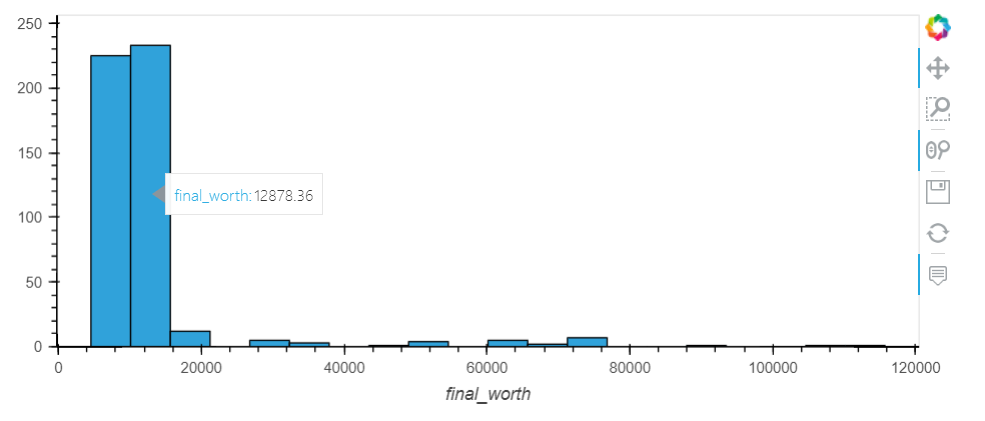
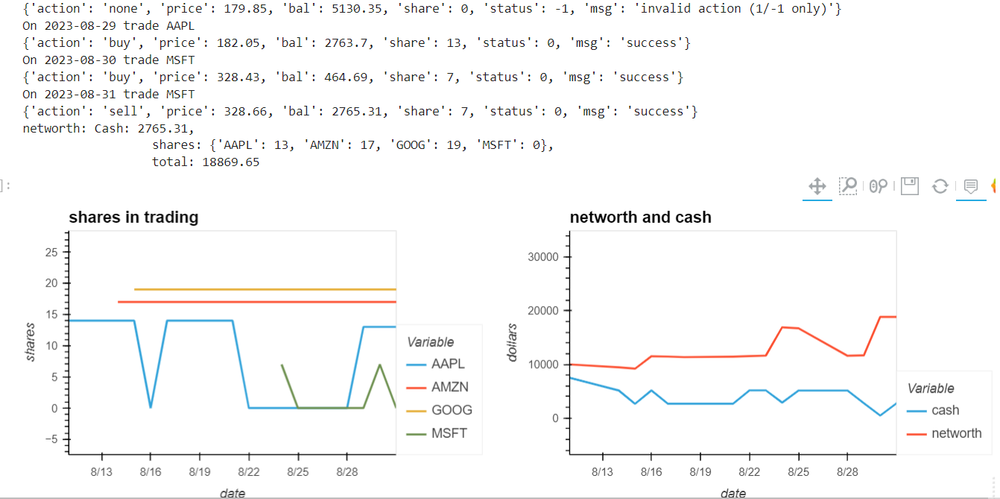
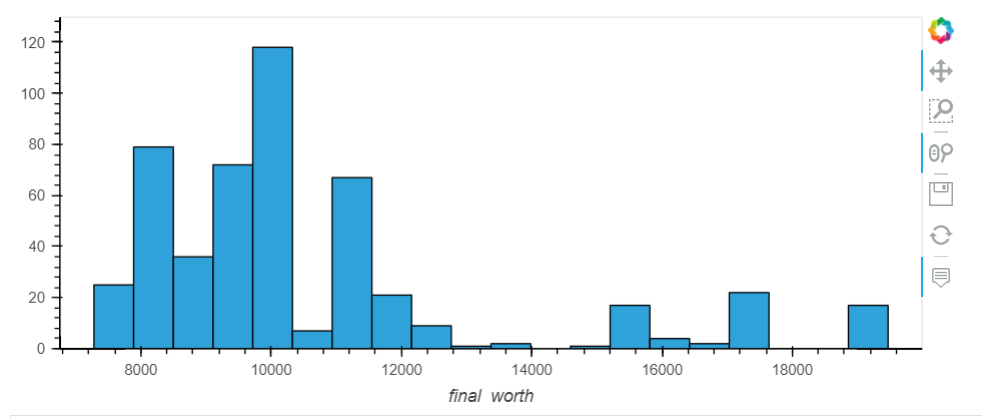

# project2-team5

## Team and Resource
Oby Nwafor: PM

Felipe Jdanov

Hazel Akongoh

Kala Pi

Flatform: Jupyter Notebookds + Google Colab

## Project Topic 

Algorithm Trading Utilizing Machine Learning

## Goal

* Using data sources from market historically, create models incorporate trading algorithm, to predict trade actions
* Starting $10,000, simulate the trading actions for 15 days, calculate the net worth at the end
* Tune the models for premium results

## Data

Historical data of tickers from Alpaca

## Cross-reference
| Algo                   |Model|Train On|Measurements|ipynb|
|------------------------|-----|-------------|--------|---|
|Simple up/down buy/sell on close price |Tensorflow Neural Net   |Scaled Numeric Columns|ML scores + Trade Action Yield|neuralnet_algo_trade|
|Simple Moving Average on close price    |Support Vector Machine + Calibrated Classifier|Simple Moving Average of close price short+long |Calibration Plot + Comparison PLot|calibrating_classifier_felipe|
|Simple up/down buy/sell on vwap |Support Vector Machine Classifier, Regression   |Daily return, Scaled Numeric Columns, Numeric Columns pct_change |Trade Action Yield|algo-trade|

## Details

Refer the corresponding Python Jupyter Notebooks

## Next Steps

* Try better curve
* Try better model
* Try better trade algorithm  


# Algo Trade Machine Learning End to End

This is an experiment to see if Machine Learning might be helpful to algorithm trading. While other team members working intensely on ML models, this notebook probes an end-to-end practical process yeilding actual trading actions, into which any premiumly trained ML model can be plug and play.

There are some special challenges in algo trade compared to other ML subjects. For example, we could only decide tentative labels which are far from actual answer, which means even if the ML model gets very high score, it still does not guarantee a good outcome. We'd need to go with some different kind of measurement. Another example is we are actually trying to predict the future, when no data is yet available. Instead of splitting train and test sets, we should only train then predict once at a time, like in the reality tomorrow comes one at a time. This requires some experimantal design targeting practicality as much as possible. 

## Experimental design

* One main ticker plus other supplemental tickers
* Gather historical data from Alpaca for 3 years up to today
* Start with 10K, process one trade action per day for "15 days" (action window)
* Predict one day at a time using previous day's data, having trained using "number of days backwards" (train window)
* While testing the trade actions use the day's market average price of open, close, high and low; If the instruction is to buy, we spend "the ticker's portion", i.e., the 1/"total number of tickers" of current available cash; If to sell, we sell all shares
* With multiple tickers action predicted, when the main ticker is not actionable, such as sell but no share, resort to the second ticker, then third, then forth, etc, to maximize the actions
* Probe the 15 days leading to today
* Move backwords one day at a time starting today, using the same sizes of train window and action window, run the training and prediction for 500 times
* Plot the distribution of the 500 experiments

## Define tickers

So far we use 4 random ones AAPL, AMZN, MSFT and GOOG. It would be easy to search and find other better tickers once we have the process built, and measurement decided

## Analysis for the algo

So far we use the simplest logic on volume weighted average price (vwap) changes for one day (daily return): gone down, buy; gone up, sell. Although we have the analysis step built in - looking for correlations amongst daily return, once and twice lagged daily return, there is not enough time for this project to try and find better curves and better logic. 

 
## Support Vector Machine in 3 different ways

### Regression train for 90 days over once and twice lagged daily return (A)




### Classification train for 90 days over all data columns scaled with StandardScaler (B)


### Regression train for 45 days over all data columns percentage change (C)




## Random trade actions 


## Conclusion

For now it does not appear that any sure conclusion can be drawn. The method A shows the most chances to make some profit while slightly lower chance to lose; Method B looks like the random distrubution, slightly to the profit side; Method C shows more chance to make more profit, though all are low. 

We will go next steps including:
* Incoporate our primal ML models out from teammate's study
* Find better curves of ticker
* Refine algos to incoporate more parameters

## Major steps

* Train - where to plug in the ML model
```
def ML_pred_a( cycle ):
    """ one cycle of n_dates_for_training + 15 days, using SVR directly on vwap pct_change """
   
    # use lagged returns to train SVM
    data = cycle.loc[:, ['lagged_daily_return', 'twice_lagged']]
    label = cycle['signal']
    instrs = pd.DataFrame()
    model = svm.SVR()
    
    # rolling train for 30 days then predict 1 day, 15 cycles for 15 instructions
    for instri in range(0,15):
        iloc_to = instri + 90
        X = data.iloc[:iloc_to,:]
        y = label.iloc[:iloc_to]
        model.fit(X, y)
        signal = model.predict(data.iloc[iloc_to:iloc_to+1,:])
        
        if signal > 0:
            instr = 1
        else:
            instr = -1
        one_row = pd.DataFrame([[cycle.index[iloc_to].date(), instr]])
        instrs = pd.concat([instrs,one_row], join='outer')
        
    return instrs
```

* Predict - multi-ticker actions


* Form instructions - one action per day


* Action
* Plot distribution

import numpy as np
import pandas as pd
from dotenv import load_dotenv
import os
import alpaca_trade_api as tradeapi
from trade import trade_action
from datetime import datetime, timedelta
from sklearn import svm
def market_data( start, end, tickers ):
    load_dotenv()
    alpaca_api_key = os.getenv('ALPACA_API_KEY')
    alpaca_secret_key = os.getenv('ALPACA_SECRET_KEY')

    # Create the Alpaca API object
    alpaca_api = tradeapi.REST(
       alpaca_api_key,
       alpaca_secret_key,
       api_version = 'v2'
    )
    
    # Set timeframe to "1Day" for Alpaca API
    timeframe = "1Day"
    
    start_date = pd.Timestamp(start,tz='America/New_York')
    end_date = pd.Timestamp(end,tz='America/New_York')
           
    # Get number_of_years' worth of historical data for tickers
    data_df = alpaca_api.get_bars(
        tickers,
        timeframe,
        start = start_date.isoformat(),
        end = end_date.isoformat()
    ).df
    if len(data_df) == 0:
        return []
    return data_df

# my main
## 1. get market data
## 2. prep data for algo
## 3. derive signal based on the observation of data
## 4. SVR on pct_change of vwap
### 4.1 the SVR ML
### 4.2 One cycle of 105 days (90+15)
#### 4.2.1 15-day trade actions
#### 4.2.2 show result
### 4.3 rolling run 500 times
## 5. SVC on scaled all columns
### 5.1 the SVC ML
### 5.2 one cycle of 105 days
### 5.3 rolling run 500 times
## 6. svr on pct_change of all columns
### 6.1 train and predict
### 6.2 one cycle of 45 days
### 6.3 rolling run 500 times
## 7. random trade action
### 7.1 randomly generate trade actions
### 7.2 show result
### 7.3 run 500 times random actions see distribution